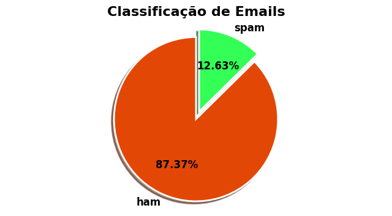
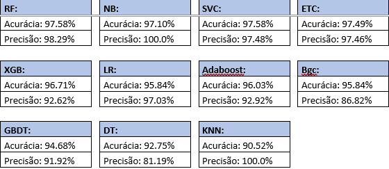
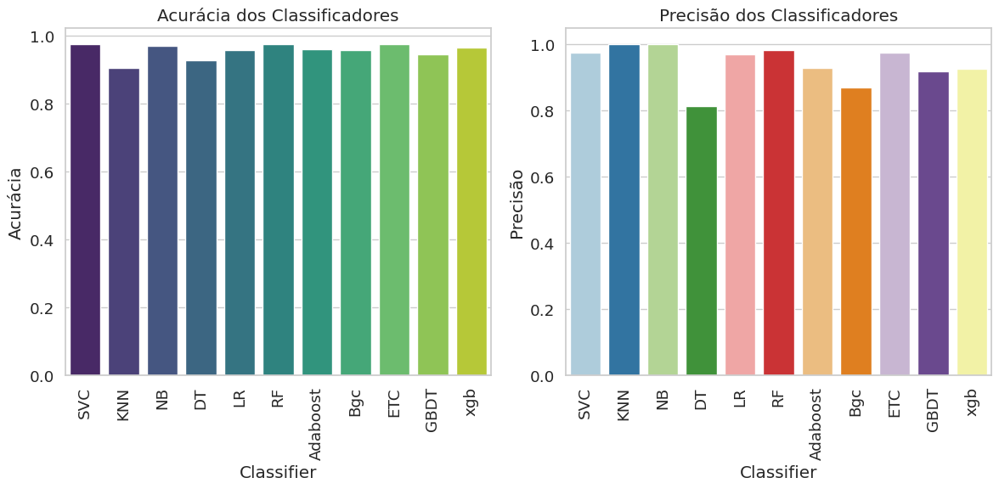

# Sistema de Prevenção de Spam em E-mails

## Introdução
Este projeto implementa um sistema de detecção de spam em e-mails utilizando técnicas avançadas de Machine Learning. Através de uma análise comparativa de diversos algoritmos, buscamos identificar a melhor abordagem para a classificação de mensagens como spam ou não-spam.

## Objetivos
- Avaliar diferentes algoritmos de Machine Learning para detecção de spam.
- Utilizar técnicas de processamento de texto (TF e DF) para extração de características.
- Implementar um modelo eficiente para classificação de e-mails.

## Dataset
O conjunto de dados utilizado é o [SMS Spam Collection Dataset](https://archive.ics.uci.edu/dataset/228/sms+spam+collection) da UCI, contendo 5.574 mensagens classificadas como spam ou ham.

## Processamento de Dados
1. **Carregamento dos dados:** Leitura do dataset e visualização inicial.
2. **Limpeza dos dados:** Remoção de colunas irrelevantes, tratamento de valores ausentes e duplicados.
3. **Pré-processamento:** Aplicação de técnicas de stemming e remoção de stopwords.

Percentual de Mensagens HAM e Spam.

## Modelos de Machine Learning
Os seguintes algoritmos foram avaliados:
- Random Forest
- Naive Bayes
- Support Vector Machine
- Logistic Regression
- Outros modelos como Decision Tree, XGBoost, etc.

## Avaliação dos Modelos
Os modelos foram avaliados com base na acurácia e precisão. Os resultados foram:

| Modelo         | Acurácia | Precisão |
|----------------|----------|----------|
| Random Forest  | 97.58%   | 98.29%   |
| Naive Bayes    | 97.10%   | 100.0%   |
| SVM            | 97.58%   | 97.48%   |
| XGBoost        | 96.71%   | 92.62%   |

## Conclusão
O modelo Random Forest apresentou o melhor desempenho geral, com alta acurácia e precisão na detecção de spam.

## Requisitos
- Python 3.8+
- Bibliotecas: pandas, numpy, scikit-learn, xgboost, matplotlib, seaborn, nltk

## Instruções
1. Clone este repositório: `git clone https://github.com/seu-usuario/seu-repositorio.git`
2. Navegue até o diretório do projeto: `cd seu-repositorio`
3. Instale as dependências: `pip install -r requirements.txt`
4. Execute os notebooks de análise exploratória e treinamento de modelo em `notebooks/`.

## Contato
- **Autor:** Saulo Rodrio de Azevedo  
- **Email:** teksauloazevedo@gmail.com
- **LinkedIn:** (https://www.linkedin.com/in/azevedosaulo/)

## Referências
- [UCI Machine Learning Repository](https://archive.ics.uci.edu/dataset/228/sms+spam+collection)
- [Kaggle Dataset](https://www.kaggle.com/uciml/sms-spam-collection-dataset)
